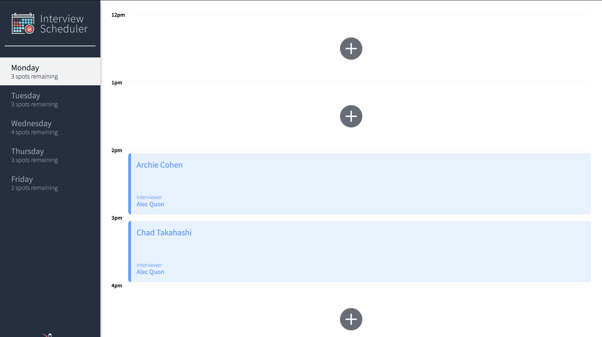
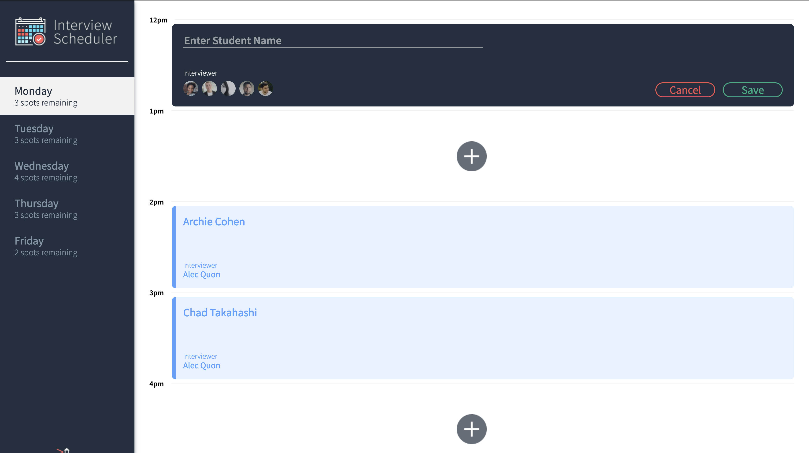
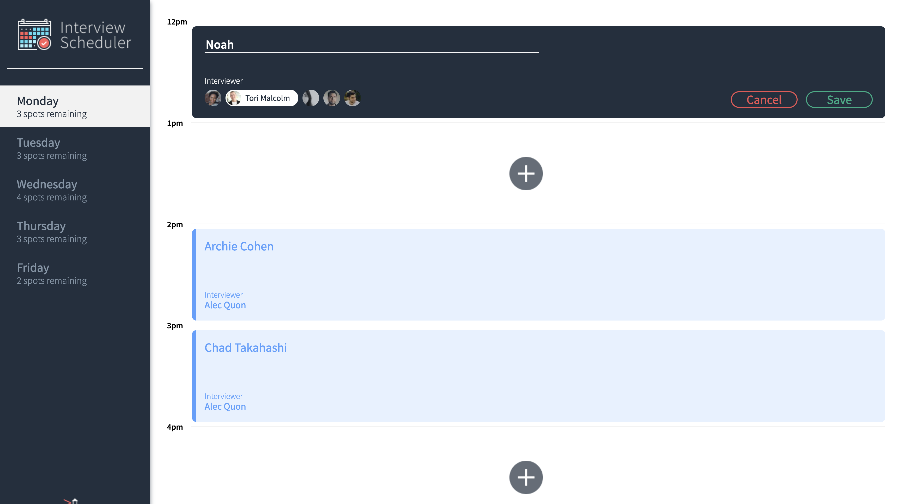
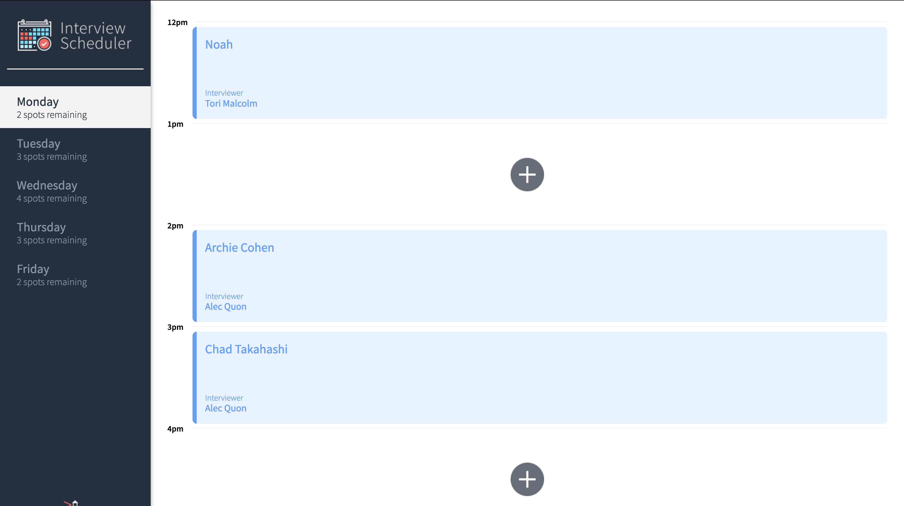
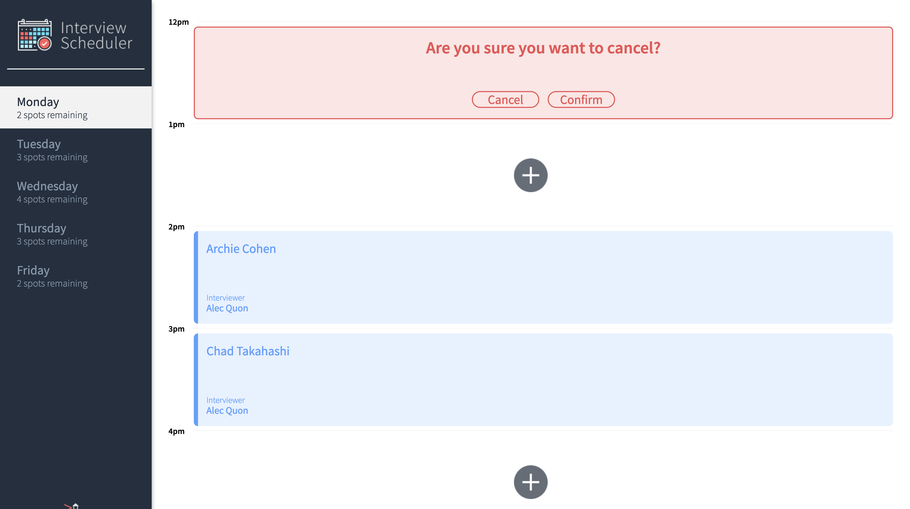

# Interview Scheduler

## Setup

Install dependencies with `npm install`.
npm upgrade chokidar

install the [scheduler api](https://github.com/noahvandenberg/scheduler-api) and follow it's instructions.


## Running Webpack Development Server

```sh
npm start
```

## Running Jest Test Framework

```sh
npm test
```

## Screen Shots 📸
### On First Load

### Click to Create Appointment

### Enter name and select interviewer

### View Your Newly Create Appointment

### Delete Your Appointment

